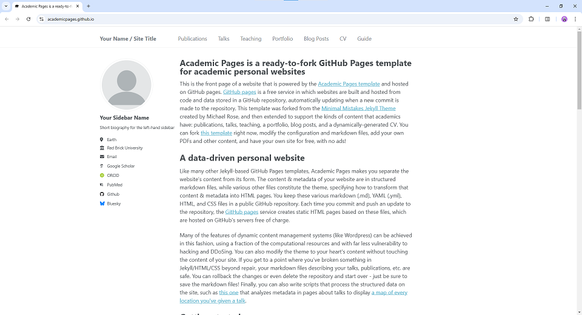

# Academic Pages
**Academic Pages is a Github Pages template for academic websites.**



# Getting Started

1. Register a GitHub account if you don't have one and confirm your e-mail (required!)
1. Click the "Use this template" button in the top right.
1. On the "New repository" page, enter your repository name as "[your GitHub username].github.io", which will also be your website's URL.
1. Set site-wide configuration and add your content.
1. Upload any files (like PDFs, .zip files, etc.) to the `files/` directory. They will appear at https://[your GitHub username].github.io/files/example.pdf.
1. Check status by going to the repository settings, in the "GitHub pages" section
1. (Optional) Use the Jupyter notebooks or python scripts in the `markdown_generator` folder to generate markdown files for publications and talks from a TSV file.

See more info at https://academicpages.github.io/

## Running locally

The site uses Ruby 3.3 and Bundler 2.6.9. On macOS, install the required Ruby first:

```bash
brew install ruby@3.3
```

On Linux or Windows Subsystem for Linux, install Ruby 3.3 with your preferred Ruby version manager and make sure compiler/build tools for native gems are available.

Install the project dependencies once:

```bash
make setup
```

Start the development server with live reload:

```bash
make serve
```

Open <http://127.0.0.1:4000>. Changes to site files are rebuilt automatically. If port 4000 is busy, choose another one with `PORT=4001 make serve`.

To produce a one-off production build in `_site/`:

```bash
make build
```

Node.js is only needed when changing the JavaScript sources. After installing Node, use `npm install` and `npm run build:js` to regenerate `assets/js/main.min.js`.

## Using Docker

Working from a different OS, or just want to avoid installing dependencies? You can use the provided `Dockerfile` to build a container that will run the site for you if you have [Docker](https://www.docker.com/) installed.

Build the container:

```bash
docker build -t jekyll-site .
```

Next, run the container:
```bash
docker run -p 4000:4000 -p 35729:35729 --rm -v $(pwd):/usr/src/app jekyll-site
```

To run the `docker run` command on Windows, you need to adjust the syntax for the volume mapping (`-v`) as Windows uses different path formats. Here's how to run your command on Windows:

### Steps for Windows:
1. **Check Docker Installation**: Ensure Docker is installed and running.
2. **Adjust Path for Volume Mapping**:

   - On Windows, replace `$(pwd)` with the full absolute path to your current directory. For example:

     ```bash
     -v C:\path\to\your\site:/usr/src/app
     ```

### Full Command Example:
```bash
docker run -p 4000:4000 --rm -v C:\path\to\your\site:/usr/src/app jekyll-site
```

### Things to Keep in Mind:
1. **Use PowerShell**:
   - If you are using PowerShell, you can use `${PWD}` for the current directory:
     ```bash
     docker run -p 4000:4000 -p 35729:35729 --rm -v ${PWD}:/usr/src/app jekyll-site
     ```

2. **Enable Docker File Sharing**:
   - If your volume doesn't map correctly, ensure Docker has access to the drive where your project resides. To do this:
     - Open Docker Desktop.
     - Go to *Settings* → *Resources* → *File Sharing*.
     - Add your drive (e.g., `C:`).

3. **Run in Command Prompt or PowerShell**:
   - In *Command Prompt*:
   
     ```bash
     docker run -p 4000:4000 --rm -v C:\path\to\your\site:/usr/src/app jekyll-site
     ```
   - In *PowerShell*:

     ```bash
     docker run -p 4000:4000 -p 35729:35729 --rm -v ${PWD}:/usr/src/app jekyll-site
     ```

# Maintenance

Bug reports and feature requests to the template should be [submitted via GitHub](https://github.com/academicpages/academicpages.github.io/issues/new/choose). For questions concerning how to style the template, please feel free to start a [new discussion on GitHub](https://github.com/academicpages/academicpages.github.io/discussions).

This repository was forked (then detached) by [Stuart Geiger](https://github.com/staeiou) from the [Minimal Mistakes Jekyll Theme](https://mmistakes.github.io/minimal-mistakes/), which is © 2016 Michael Rose and released under the MIT License (see LICENSE.md). It is currently being maintained by [Robert Zupko](https://github.com/rjzupkoii) and additional maintainers would be welcomed.

## Bugfixes and enhancements

If you have bugfixes and enhancements that you would like to submit as a pull request, you will need to [fork](https://docs.github.com/en/pull-requests/collaborating-with-pull-requests/working-with-forks/fork-a-repo) this repository as opposed to using it as a template. This will also allow you to [synchronize your copy](https://docs.github.com/en/pull-requests/collaborating-with-pull-requests/working-with-forks/syncing-a-fork) of template to your fork as well.

Unfortunately, one logistical issue with a template theme like Academic Pages that makes it a little tricky to get bug fixes and updates to the core theme. If you use this template and customize it, you will probably get merge conflicts if you attempt to synchronize. If you want to save your various .yml configuration files and markdown files, you can delete the repository and fork it again. Or you can manually patch.

---
<div align="center">
    

[](https://github.com/academicpages/academicpages.github.io/graphs/contributors)
[](https://github.com/academicpages/academicpages.github.io/releases/latest)
[](https://github.com/academicpages/academicpages.github.io/blob/master/LICENSE)

[](https://github.com/academicpages/academicpages.github.io)
[](https://github.com/academicpages/academicpages.github.io/fork)
</div>
